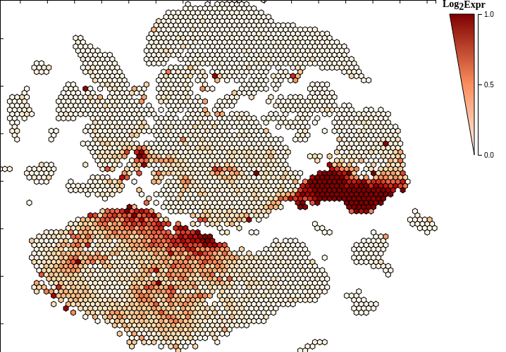
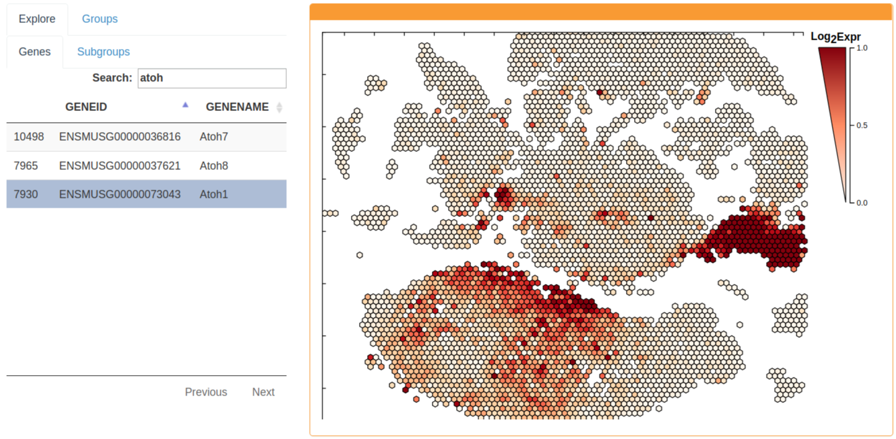
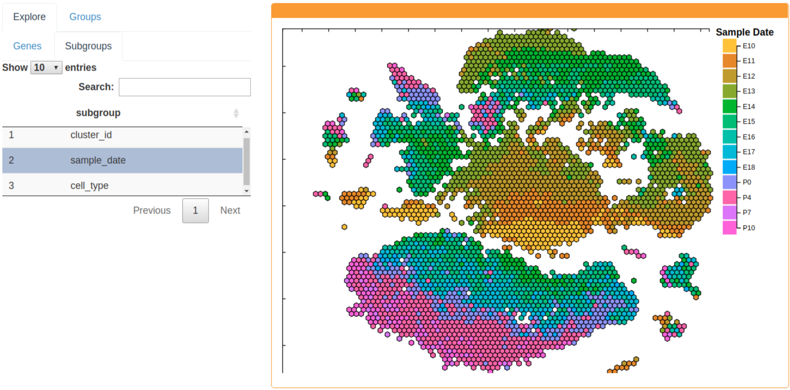
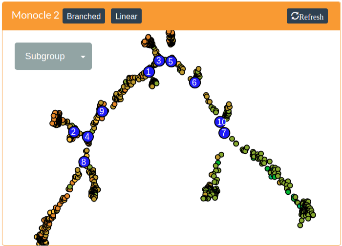
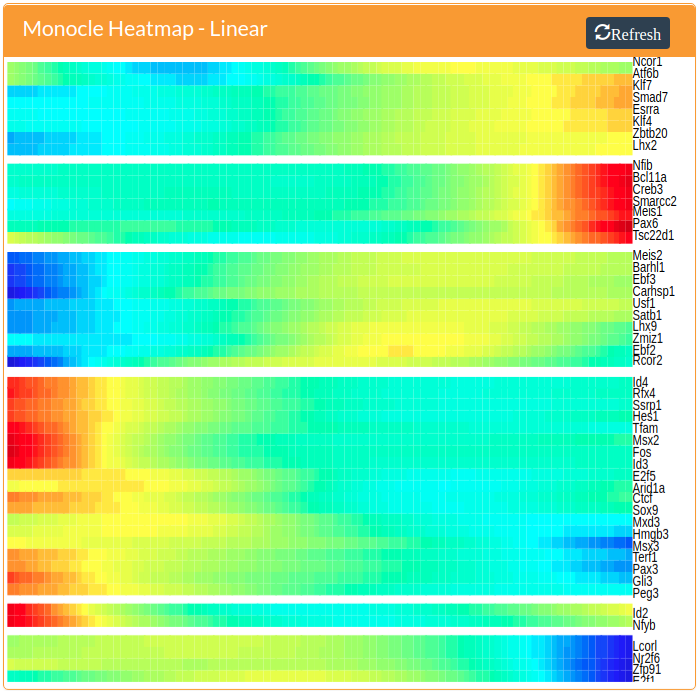
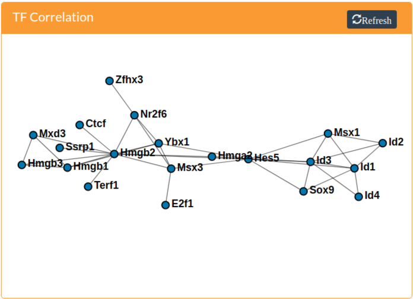

## Overview

Single Cell Explorer is a web application that allows interactive exploration from single-cell RNA-seq (scRNA-seq) datasets. It was designed to allow researchers to explore the developing murine cerebellum at single-cell resolution to generate hypotheses and identify gene-expression trends associated with cerebellar cell types throughout the development of the cerebellum from developmental day 10 (e10) through post-natal day 10 (p10)

Although the initial application was developed for exploring the cerebellum dataset, it has several features that make it suitable for the exploration of any RNASeq dataset:
1. Separation of data from the location of analysis. Since CellSeek is a web application, the location of the dataset is not restricted to the location of the analysis. This will facilitate integration of the ever-increasing dataset sizes as the number of single cells examined in a single experiment pushes into 7 figures, while the popularity of scRNASeq increases simultaneously.
2. Scalability. Two main features make CellSeek scalable. First, it uses a scatterhex grid display, which aggregated data to reduce noise and speed up image rendering. Second, only non-zero values are transmitted across the network. Since current scRNA-seq techonology generates sparse datasets, transferring only non-zero entries increases data transfer speed. 
3. R as the server-side language. CellSeek uses Rstudio's Shiny on the server side. Since the server side code is written in R, it is easy to integrate functionality from exisiting R code and packages. In particular, future interactive analyses can use any of the packages from the [Bioconductor](https://www.bioconductor.org/) project, making the expansion of CellSeek analyses straightforward.

## Usage

### Scatterhex plot

The scattergrid plot is the primary means to explore the dataset and is always visible. The scattergrid is a grid of fixed-size hexagons that occupies the plot area. A hexagon is rendered if it overlays at least one cell in the underlying scatterplot. Since the maximum number of hexagons is fixed, data can be quickly rendered and is limited primarily by network transfer speeds. Additionally, the scattergrid format allows interaction with the scattergrid plot itself, which leads to better interaction with the data.

Since each hexbin is representative of at least one cell, summary functions are used to map the feature of interest from all component cells to an encompassing hexbin [See the explore tab below]. This summarizing feature alleviates much of the noise observed in single-cell RNASeq datasets and helps identify expression trends, for example, in similar cells.

Functionality is dependent on the selected tab left of the scattergrid plot. For example, zooming is enabled when the explore tab is selected, whereas group selection and the lasso is activated when the group tab is selected. See below for details.

### Explore Tab

The explore tab allows interactive exploration of the dataset by mapping various features onto the scatterhex grid. It is divided into the Genes tab and the Subgroups tab. The Genes tab maps genes onto the scatterhex grid and the subgroups map cell-level data such as sample date or predicted cell type onto the scatterhex grid. Searching for genes or subgroups can be perfomed using the search bar, although this usually only makes sense for the gene tab due to the large number of genes in RNA-seq datasets.

Zooming and panning is enabled when the Explore tab is selected. Zooming allows more granular exploration of cells of interest, since zooming in will reduce the number of cells that are being summarized in each hexbin.

Gene expression can be explored by selecting the Genes tab. The gene expression of a hexgrid is summarized as the mean expression of all component cells. The gene expression legend is adjustable by scrolling the mouse wheel over the numeric scale to the right of the scatterhex grid legend.

The Subgroups tab allows exploration of cell-level data. Currently, Subgroups include sample date, cluster ID, and cell type. Sample date is the sampling date of the cell and will indicate the emryonic or post-natal day of the sampled cells. Cluster ID denotes the assigned cluster of each cell. The cell type of each cell is determined by the expression of marker genes. For more information on how these were determined, please see the manuscript. Hexgrids are currently summarized by the most frequent feature of the component cells.

### Groups Tab

The group tab allows focused exploration of subsets of cells. When this tab is selected, cells can be selected by using the lasso tool or by double-clicking on either a hexbin that displays the phenotype of interest, or the colored square of the legend that displays this phenotype. Holding down the shift key appends to the existing selection.

There are currently two different analyses that can be performed for a group of selected cells: Pseudotime analysis or TF Correlation Network construction. These are outlined below. 

## Pseudotime Analysis

Pseudotime analysis runs Monocle 2 'under the hood'. Since Monocle 2 run times can get long for large datasets, cells from the selected subgroup are subsampled to 1000 cells when the number of cells is greater than this value. Currently, only transcription factors that are present in at least 10% of the selected (and possibly subsampled) cells are included in the monocle run. The output from moncole can be colored by the same features as the scatterhex grid and are updated as the selected features from the scatterhex grid are changed. Note that the Genes sub-tab must be selected to map gene expression onto the monocle tree and likewise for any of the subgroup variables.

A heatmap of transcription factors that show either branch-specific expression or have expression patterns that vary with pseudotime can be generated by pressing the Branched button or the Linear button, respectively. These are generated by Monocle 2. Both of these methods require the specification of the root of the tree, which assigns cells in the root a pseudotime vaslue of zero and propogates increasing pseudotime values up the tree and down all incident branches. Please see the Monocle 2 manuscript (Trapnell *et al.* 2014) or the [online documentation](http://cole-trapnell-lab.github.io/monocle-release) for more information.

In addition to rooting the tree, the branched analysis requres the specification of a branching node. These are the larger blue nodes in the monocle tree. A branching node can be specified by clicking on it. The selected branch will be colored red to indicate it is the branching node.

## TF Correlation Network

Correlation networks are constructed from the expression profiles of mouse transcription factors obtained from AnimalTFDB (Zhang *et al.* 2012). Only transcription factors present in at least 10% of the selected cells are used for the correlation calculation. In the resulting TF correlation network, edges connect TFs if the Pearson correlation between their normalized expression is at least 0.25. Nodes can be selected by clicking on them. The selected gene will display in the scatterhex grid if the Genes sub-tab is selected and in the monocle 2 tree if the Gene option is available and selected in the dropdown menu.

## Acknowledgements

This application relies heavily on code that others have developed. Here is a list in no particular order of software and packages that were used and deserve thanks:

* [R](https://cran.r-project.org/)
* [RStudio's Shiny](https://shiny.rstudio.com/)
* [D3](https://d3js.org/)
* [Bootstrap 3](http://getbootstrap.com/)
* [Monocle 2]()

## References

1) Trapnell C, Cacchiarelli D, Grimsby J, Pokharel P, Li S, Morse M, Lennon NJ, Livak KJ, Mikkelsen TS, Rinn JL. 2014. The dynamics and regulators of cell fate decisions are revealed by pseudotemporal ordering of single cells. *Nat. Biotechnol.* **32**:381-386.

2) Zhang HM, Chen H, Liu W, Liu H, Gong J, Wang H, Guo AY. 2012. AnimalTFDB: a comprehensive animal transcription factor database. *Nucleic Acids Res.* **40**:D144-D149.
